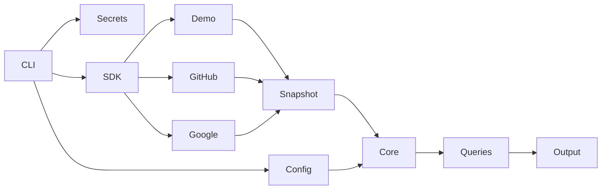

# Architecture

Status: accepted implementation design; pre-release.

Use a Rust workspace with `permesh-core` (serializable domain and deterministic queries), `permesh-provider-sdk` (discovery/health contracts), `permesh-config` (strict YAML and workspace discovery), `permesh-secrets` (references and native resolution), `permesh-provider-demo`, `permesh-provider-github`, `permesh-provider-google`, and `permesh-cli` (application orchestration and output modules). The `permesh-provider-protocol` crate provides pure, bounded offline wire validation into core snapshots. The `permesh-provider-external` crate owns local native-binary registration and subprocess supervision. Presentation stays in CLI modules.

Dependencies point inward: providers depend on SDK/core/secrets, never CLI. Core has no network, filesystem, keychain, or terminal concerns. The application resolves credentials explicitly and concurrently collects provider snapshots with a bounded task set, deadlines, and Ctrl+C cancellation. A failed provider contributes a structured issue, never an apparently successful empty snapshot.

Snapshots retain provider-scoped immutable IDs, observation timestamps, resources, groups, memberships, grants, and warnings about visibility. Traversal follows account/group membership edges with cycle protection and yields explicit paths. It does not fabricate provider authorization semantics. Identity matching uses explicit instance/account mappings and exact verified emails only; duplicate candidate identities remain ambiguous. Public GitHub email is not verified identity evidence.

No discovery data is persisted. Exports are future functionality; JSON goes to stdout under the caller's control. Query commands never rewrite configuration. Plain output uses vertically arranged records to work in narrow terminals, with escaped control characters. Structured output is independently serialized, schema-versioned, and deterministic apart from observation times.

Alternatives: one crate would weaken adapter boundaries; a crate per every conceptual type would multiply maintenance without a use case. The workspace crates provide a modest boundary around security-sensitive responsibilities. A full graph database and foreign runtime embedding are unnecessary.

The identity index and bounded graph traversal are shared by user and admins queries. Admins builds identity evidence once and reverse-indexes membership relevance from nonstandard grants before enumerating paths; it does not rescan the graph once per account or discard ambiguous accounts. Known privileged paths, unknown privilege paths, and grants without account paths remain separate in results.

External transcripts follow `bounded NDJSON → strict envelope/capabilities → normalized records → core validation → sorted snapshot`. The offline developer validator returns counts only. Explicit `provider external` commands use incremental validation and supervised native execution. Ordinary workspace queries do not launch external programs.
