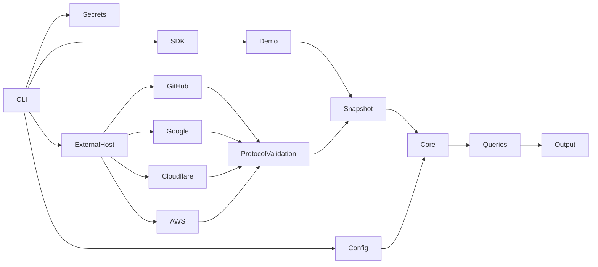
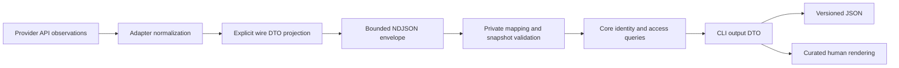
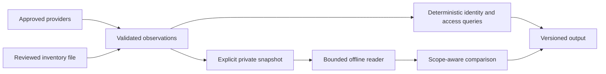

# Architecture

Status: accepted implementation design; pre-release.

Use a Rust workspace with `permesh-core` (normalized domain and deterministic queries), `permesh-provider-sdk` (discovery/health contracts), `permesh-config` (strict YAML and workspace discovery), `permesh-secrets` (references and native resolution), `permesh-provider-demo`, and `permesh-cli` (application orchestration and output modules). The `permesh-provider-protocol` crate provides pure, bounded versioned discovery
and health validation. The `permesh-provider-external` crate owns protected native
registrations, workspace approval fingerprints, private invocation credentials
and subprocess supervision. Presentation stays in CLI modules.

Dependencies point inward: providers depend on SDK/core/secrets, never CLI. Core has no network, filesystem, keychain, or terminal concerns. The application resolves credentials explicitly and concurrently collects provider snapshots with a bounded task set, deadlines, and Ctrl+C cancellation. A failed provider contributes a structured issue, never an apparently successful empty snapshot.

Snapshots retain provider-scoped immutable IDs, observation timestamps, resources, groups, memberships, grants, and warnings about visibility. Traversal follows account/group membership edges with cycle protection and yields explicit paths. It does not fabricate provider authorization semantics. Identity matching uses explicit instance/account mappings and exact verified emails only; duplicate candidate identities remain ambiguous. Public GitHub email is not verified identity evidence.

Discovery remains transient by default. Explicit `snapshot create` writes a private, versioned local artifact; offline inspection and comparison never resolve credentials or execute providers. Snapshot DTOs are independent of domain and wire serialization. See [snapshot boundaries](snapshots.md). JSON also goes to stdout under the caller's control. Query commands never rewrite configuration. Plain output uses vertically arranged records to work in narrow terminals, with escaped control characters. Structured output is independently serialized, schema-versioned, and deterministic apart from observation times.

Alternatives: one crate would weaken adapter boundaries; a crate per every conceptual type would multiply maintenance without a use case. The workspace crates provide a modest boundary around security-sensitive responsibilities. A full graph database and foreign runtime embedding are unnecessary.

The identity index and bounded graph traversal are shared by user, admins and orphaned queries. All queries reverse-index membership relevance from selected grants before enumerating paths; they do not rescan the graph once per account or discard accounts simply because they have no grants. Known privileged paths, unknown privilege paths, and grants without account paths remain separate in results.

External transcripts follow `bounded NDJSON → strict envelope/capabilities → normalized records → core validation → sorted snapshot`. The offline developer validator returns counts only. Standalone `provider external discover` uses draft 1. Workspace external
operations follow `validated config → registered digest/capabilities → exact local
approval → credential resolution → supervised explicitly selected handshake → private request
→ validated health/snapshot`. Approval binds the canonical config path, instance,
selected provider configuration, relevant identity mappings/authority and registration. Ordinary queries merge only validated
snapshots using existing partial-result and source-authority rules. Cancellation
signals running external operations and awaits cleanup rather than dropping them.

GitHub and Google execute only through the external protocol host after digest verification
and workspace approval. Their adapters live in the separate providers repository.
`ProviderKind::Github` and `ProviderKind::Google` remain legacy parsing markers for explicit configuration
migration; all legacy invocation paths fail before credential resolution.

## Compatibility boundaries

Protocol-owned record DTOs and capabilities freeze existing discovery drafts.
Private mapping functions assemble a snapshot; the decoder exposes it only after
completion, EOF and domain validation. Official runtime emission projects fields
explicitly onto those DTOs. CLI-owned query and control DTOs likewise keep core,
config and local storage serde from defining JSON output. Setup/browser specs
remain deliberately versioned SDK boundary types.

Core principals now separate kind, affiliation and lifecycle. Resource containment
is validated independently from access edges; grants retain explicit evidence
kinds and paths derive certainty without rewriting source observations. Access
JSON uses schema 2 while control reports remain schema 1. Legacy wire mapping
leaves unexpressed fields unknown; official 0.2.0 source candidates emit the richer dimensions through negotiated
protocol v1. Verified package metadata selects this contract during guided setup;
separately trusted executables require an explicit setup selector.

Domain semantics are not declared stable yet. See the
[architecture audit](audits/architecture-hardening.md) for identity dimensions,
resource containment, evidence and negotiated-operation migration decisions.

## Local review inputs

The explicit [identity inventory](identity-inventory.md) is a bounded host-local
JSON reader. It is the intentional exception to external production adapters:
there is no executable, network transport or authentication involved. Its reviewed
byte digest, declared scope, export time and completeness describe the imported
assertions. It cannot establish employment or verify an arbitrary email address.

Identity mappings use immutable provider account IDs and authoritative canonical
IDs. The [mapping workflow](identity-mapping.md) reviews a proposed aliases change
before an atomic configuration write. Conflicting authoritative evidence remains
ambiguous.

Snapshot comparisons retain source failures and scope changes. A newer scan does
not prove revocation: missing records are classified only within comparable visible
scope, and older or overlapping observations cannot establish disappearance.
