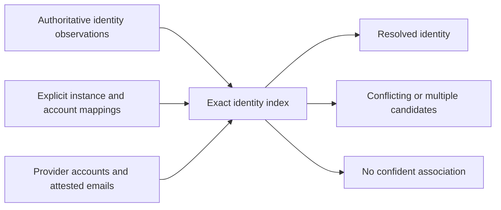
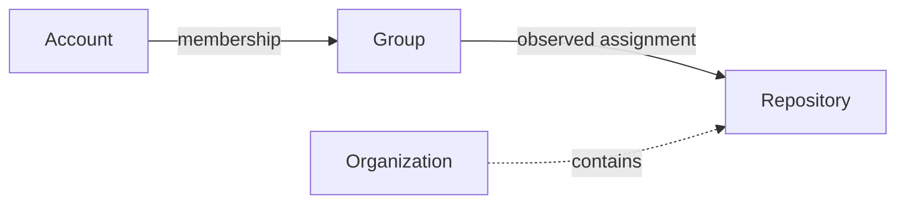

# Domain language and invariants

Permesh models observed principals and access metadata, not employees or proven
successful authorization. Stable identifiers and evidence survive normalization;
unknown information remains unknown.

## Principal dimensions

Canonical `Identity` and provider `Account` records carry three independent fields:

| Field | Values | Meaning |
| --- | --- | --- |
| `kind` | human, service, bot, unknown | What sort of principal the source identifies |
| `affiliation` | internal, external, unknown | Its observed relationship to the organization |
| `status` | active, inactive, suspended, unknown | Its lifecycle state |

An external human can be suspended. An internal service principal can be inactive.
A directory entry is not proof of employment, and an account without a canonical
identity is not necessarily an abandoned employee account. Account lifecycle is
its own provider observation; it does not overwrite authoritative identity state.

`EntityKey` combines provider instance ID and immutable native ID. Logins, display
names and email addresses do not replace native IDs. Canonical identities retain
an authority-scoped stable ID and attested emails. Aliases map an instance and
immutable account ID to a canonical ID; they do not assert active status.

Matching uses exact, case-sensitive attested email or explicit native-ID aliases.
Public profile emails and display-name similarity never establish a match.
Matching canonical IDs combine sorted, deduplicated attested emails only when
kind, affiliation and status agree. Conflicting dimensions remain ambiguous
regardless of source ordering; aliases cannot erase contrary identity evidence.

## Resources and containment

A `Resource` has a stable key, label, optional namespaced `kind` and optional
`parent` key. Kinds are provider-owned strings such as `github.repository`,
`aws.account` and `cloudflare.zone`; Permesh has no universal resource-type enum.
Unknown kind and unobserved parent are represented by null in access JSON.

Kinds are at most 128 ASCII bytes, contain at least two dot-separated segments,
and each segment is 1–64 characters: first a lowercase letter, then lowercase
letters, digits, `_` or `-`. A parent must exist in the same provider snapshot.
Self-parenting, cycles, dangling parents and cross-instance parents are invalid.
Validation is iterative and independent of discovery order.

The containment edge does not create access. Only observed membership and access
evidence contribute paths. A parent-level observation is not silently copied to
every child resource. Groups retain their own stable keys and labels; nested
group membership is separate from resource containment.

## Access evidence

`Grant` is retained as the internal record name, but represents access evidence.
Its `evidence_kind` distinguishes:

- `permission`: an observed permission record within the provider's scope;
- `assignment`: a role or entitlement assigned to a subject and resource;
- `policy_attachment`: an observed policy attachment;
- `unknown`: the source did not establish the evidence category.

Every record retains its native role, subject, resource, broad normalized
privilege and provenance. Privilege is standard, elevated, admin, owner or unknown.
A policy called AdministratorAccess is not proof of effective administrator access.
Explicit denies are not positive grants; they require a separate future contract.

Certainty describes evidence: observed, derived, inferred or unknown. An
`AccessPath` preserves its original grant and all membership hops. A path through
observed memberships with an observed grant has derived path certainty; the
underlying grant remains observed. Inferred and unknown grant certainty are never
promoted by traversal. Neither permission evidence nor observed certainty proves
that every action is authorized: hidden policies, branch protections, conditions
and other provider rules may apply.

Membership and grant provenance retain the observation method and UTC RFC3339
time. Multiple paths remain distinct. A snapshot carries one provider's records,
limitations and completeness; cross-provider reads are not transactional.

## Validation and compatibility

IDs must be nonempty and unique in their record class. Relationships must refer
to existing records in the same provider snapshot before queries run. Collection
and path-expansion limits fail explicitly rather than silently truncating.
Missing accounts in partial results cannot establish absence of access.

The Rust domain API, legacy wire DTOs and CLI output DTOs are separate contracts.
Legacy ingress fills unexpressed dimensions with unknown; it never upgrades old
records by guessing from resource labels or method strings. See the
[domain and output migration](migrations/domain-schema-2.md),
[normalization guide](provider-development/normalization.md) and
[output contract](output-schema.md). Negotiated wire support for all new dimensions
remains a subsequent slice; this domain migration does not declare a stable SDK.
