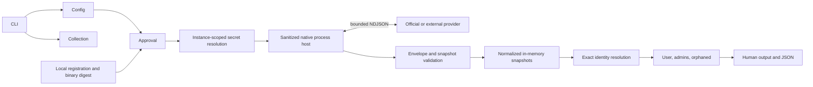

# Architecture hardening audit

Audited 2026-09-08 against CLI `f830270dad892d48bb8aa39394b4fc63210a3269`
and official providers `ba672ae426a740a31d23a8540eb87e488d51e5e8`.
This is a source and offline behavior audit, not a live tenant qualification or
an independent penetration test. Priorities describe readiness for contract
stability; P0 does not imply an exploitable vulnerability.

## Current architecture

The Rust workspace separates core queries/domain, configuration, secrets, SDK,
protocol validation, external execution, CLI application/presentation, demo and
the remaining bundled Google adapter. Official native GitHub, Google,
Cloudflare and AWS adapters live in the sibling providers repository and share
a bounded native runtime. Only GitHub 0.1.0 is published in the provider catalog.
The CLI release is 0.1.0-alpha.2. Neither protocol nor SDK should yet be described
as stable.

`permesh-core` has indexed identity resolution and reusable query/traversal
functions already. Commands do not need a new query framework. Provider
collection is bounded to four concurrent operations. Results retain native
roles, membership paths, UTC provenance, provider completeness and limitations.
No persistent access graph, telemetry or backend exists.

## Strengths to preserve

- Native subprocesses, cleared environment, private working directory, bounded
  stderr/stdout, deadlines, process-group/Windows job cleanup and cancellation.
- Exact binary registration, private local trust files, canonical workspace
  binding and approval before credential resolution. Installation is distinct
  from permission to execute or receive credentials.
- Strict framing, duplicate-key rejection, strict envelopes, exact capability
  agreement, reference validation and completion plus EOF before accepting data.
- Host-owned browser authentication state, PKCE, loopback callback, no redirects,
  bounded zeroizing token buffers and configuration revalidation before storage.
- Exact attested email/native-ID aliases, preserved ambiguity, explicit identity
  authority, unassessed orphan review when authority is incomplete.
- Conservative AWS policy inventory and provider limitations in documentation;
  unknown privilege is not guessed from policy names.
- Read-only API adapters, bounded pagination/retries, mock HTTP tests, native
  protocol tests, cross-platform CI, deterministic synthetic demo and exit codes.

## Findings and evidence

| ID | Priority | Finding and source | Recommendation |
| --- | --- | --- | --- |
| H01 | P0 | Protocol `wire.rs::Record` embeds core Identity/Account/Resource/Group/Membership/Grant; strict serde round trip makes domain serialization the wire contract. Native runtime `response.rs` serializes those records directly. | Freeze historical transcripts, introduce protocol-owned DTOs and validated conversion before domain edits. |
| H02 | P0 | CLI `app.rs` serializes core user/admin/orphaned results; `external.rs` serializes Snapshot. Human rendering reparses those JSON values. | Freeze schema-1 query/snapshot DTOs and fixtures independently of core. Inventory remaining control-command DTOs before stability. |
| H03 | P0 | Core `model.rs` mixes External/Service into both identity kind and status; resource has only key/name; Grant cannot distinguish an assignment from effective permission; certainty lacks derived. | Introduce independent principal, affiliation and lifecycle dimensions, typed resource hierarchy and access-evidence semantics behind the compatibility boundaries. |
| H04 | P0 | Existing draft versions 1–4 select discovery/configured health/setup/browser-description generations; capability is only record discovery. | Preserve existing drafts; define one new negotiated contract only after its incompatible envelope/schema is explicit. Future compatible operations use capabilities, not version increments. |
| H05 | P1 | `workspace.rs::add` persists YAML without revalidating its serialized size or retaining the loaded revision. Offline reproduction: valid 1,039,342-byte config becomes unloadable 1,122,010-byte config, exit 0. | Reuse bounded captured-revision writes; test original bytes survive rejection. |
| H06 | P1 | `approvals.rs::fingerprint` binds the entire supplied workspace config; unrelated providers invalidate approvals. | Version a provider-scoped security context including canonical workspace, instance config, credential references and full registration; invalidate old approval once, fail closed thereafter. |
| H07 | P1 | Official add rejects GitHub; install output requires manual path/hash/capability/trust/setup/approval work despite verified package metadata. | Orchestrate existing services with explicit execution/credential consent and resumable state; retain expert workflow. |
| H08 | P1 | Explicit proxy/custom CA context absent; sanitized native environment prevents ordinary corporate networking settings. | Define validated per-provider network inputs, bind them to approval, negotiate support and reject unsupported configuration. Do not inherit shell settings. |
| H09 | P2 | Native runtime emits `unsupported` for non-Google `describe_auth`; host accepts `unsupported_method`. Reproduced against actual GitHub/Cloudflare/AWS binaries offline. | Correct code and test runtime responses through the host decoder. |
| H10 | P2 | Provider diagnostics collapse tenant conflicts, visibility gaps and API failures into broad static limitations. | Add finite, bounded diagnostic identifiers in the negotiated contract, with host-owned explanations and no free-text reflection. |
| H11 | P2 | Registry hashes then returns a path; credentials resolve before host spawns it. Same-user binary replacement remains possible. | Narrow verification/execution gap and test substitution; document OS limitations. Trusted native code is not a sandbox. |
| H12 | P2 | Traversal clones complete path prefixes; sort comparator allocates vectors; only admins prunes grant-irrelevant paths. | Share reachability filtering and allocation-free comparison; retain explicit path limits and all selected accounts. Benchmark before deeper optimization. |
| H13 | P2 | GitHub repeated stable IDs use first-wins metadata; conflicting duplicates need stronger completeness treatment. AWS lacks discovery runtime-to-host cross-decode coverage. | Add conflict fixtures and reusable normalization contracts, including conservative AWS evidence. |
| H14 | P2 | Doctor/status collapse local approval, secret, protocol and remote failures; provider metadata lacks maturity/auth/compatibility details. | Curated stage/code diagnostics and separate concise overview from detailed preflight. |
| H15 | P3 | Native auth ecosystems, Identity Center, Entra, developer trust mode, lock state, snapshots and policies need explicit contracts. | Design extensions after H01–H08; do not expand provider count or execute ambient credential processes. |

## Proposed breaking changes and migration gates

1. **Rust domain API:** identity enums/fields, resource fields and evidence fields
   will change. Migrate bundled and official adapters together, retaining stable
   entity IDs. Old records must map conservatively (unknown where unexpressed).
2. **Wire:** DTO extraction must preserve existing draft bytes. New semantics,
   diagnostics/network context and operation negotiation require a separately
   documented contract. Never silently redefine drafts 1–4 or downgrade trust.
3. **CLI JSON:** schema 1 must remain frozen during extraction. New identity and
   evidence semantics need an explicit schema transition; do not squeeze
   suspended into inactive or service into lifecycle without documented legacy
   projection. Preserve failure `{}` versus partial-not-found typed output.
4. **Approvals:** a new domain separator/context format intentionally invalidates
   existing approvals once. Registration/digest/security settings still invalidate
   trust. Unrelated provider changes should then stop invalidating an approval.
5. **Configuration:** no implicit migration. New network settings must be explicit
   and validated; local state and shared declarations remain separate. Existing
   pins must not change as a side effect of updates or queries.

Published binaries, release tags and catalog entries remain immutable. Source
changes alone do not qualify unpublished providers for live use.

## Deliberately unchanged

Do not introduce dynamic libraries, servers, WASM, embedded runtimes, persistent
databases, provisioning, fuzzy/AI matching, telemetry, generic service locators
or another query abstraction layer. Resource containment must not imply access
inheritance. Unknown evidence must not become effective authorization. Keep
native provider roles and the existing curated rendering system.

The host is a trusted native execution boundary, not filesystem/network
confinement. Browser endpoint checks constrain textual URLs, not all possible
DNS resolutions. Same-user/administrator modification of trusted processes is
an OS-level residual risk. Secret-reflection checks reduce accidental disclosure;
they cannot make a deliberately malicious trusted executable safe.

## Execution order

See [the hardening backlog](architecture-hardening-backlog.md). Boundary
extraction precedes domain evolution because both public formats currently
depend on core serde. This is a dependency-driven adjustment to the proposed
slice order, not a replacement architecture.
