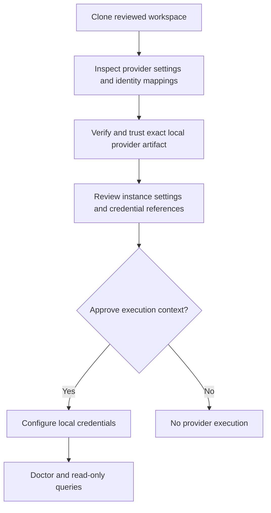

# Team workspaces

Teams share access configuration through Git and keep credentials and execution
approval local. Permesh has no collaboration server and does not synchronize
reports, secrets or trust records.

| Shared and reviewed in Git | Local to each administrator |
| --- | --- |
| Provider instance IDs and nonsecret settings | Installed native packages and binary registrations |
| Credential references | Environment values or native keychain entries |
| Explicit identity aliases and source authority | Canonical-workspace execution approvals |
| Currently supported explicit executable pins | Temporary provider working directories |

Use distinct stable instance IDs for unrelated tenants. Keychain service/account
names bind to instance and credential slot at user level, so reusing an instance
ID in another workspace reuses that local credential entry.

After cloning, inspect configuration and identity mappings before approving
external execution. Install the reviewed provider artifact, establish local
binary trust, then review and approve the instance in the cloned workspace.
Authenticate independently using the configured references. `auth status` checks
local availability; `doctor` performs approved provider health checks. A health
check is not proof of complete discovery visibility.



Approval binds the canonical config path, selected provider configuration,
registration and relevant identity context. A cloned path needs its own approval.
An unrelated provider edit does not revoke another instance's scoped approval;
changed settings, credential references, relevant aliases, authority or binary
do. Older whole-workspace approvals require one explicit reapproval during the
hardening migration. See [the exact scope](adr/0017-provider-scoped-workspace-approval.md).

## One release across platforms

Use `permesh provider add github --portable` to configure an official provider
for a mixed-platform team. The selected native release fixes the version for
all included platforms. Permesh reads the target digests from the same validated
public catalog, checks that their discovery contracts and capabilities agree,
and downloads only the native archive. The consent flow shows the selected
local executable and the shared pins. Authentication remains a separate step.

Portable mode requires at least two available targets for the selected release.
It never combines the newest version from each platform independently. Catalog
checksums do not constitute publisher signature verification or live provider
qualification. The usual explicit binary trust and instance approval still apply.

The shared configuration uses a map instead of the original scalar digest:

```yaml
external:
  provider: github
  discovery_protocol: negotiated_v1
  sha256_by_target:
    aarch64-apple-darwin: REPLACE_WITH_REVIEWED_MACOS_EXECUTABLE_DIGEST
    x86_64-unknown-linux-gnu: REPLACE_WITH_REVIEWED_LINUX_EXECUTABLE_DIGEST
  configuration:
    organizations: [example]
  credentials:
    token: keychain://github-main/token
```

This is an excerpt; actual digests are 64 lowercase hexadecimal characters.
Supported map keys are `aarch64-apple-darwin`, `x86_64-apple-darwin`,
`aarch64-unknown-linux-gnu`, `x86_64-unknown-linux-gnu` and
`x86_64-pc-windows-msvc`. Selection follows the running CLI's compiled platform,
including when it runs under emulation. There is no execution target override.

Each teammate installs the same version locally, explicitly trusts their native
binary, then reviews and approves the instance. Local registrations and approvals
are never imported from the shared Git workspace. A missing platform pin fails
before credentials are resolved; Permesh never chooses another target or follows
the locally selected/latest package instead.

## Advanced providers and existing workspaces

The advanced workflow accepts repeated `--target-sha256 TARGET=DIGEST` arguments:

```bash
permesh provider add external --provider internal --id internal-main \
  --discovery-protocol negotiated-v1 \
  --target-sha256 aarch64-apple-darwin=REVIEWED_MACOS_DIGEST \
  --target-sha256 x86_64-unknown-linux-gnu=REVIEWED_LINUX_DIGEST
```

This writes configuration only; it does not install, trust or run anything.
Alternatively replace `sha256` with `sha256_by_target` in a reviewed Git change.
Exactly one pin form is allowed. Empty maps, duplicate keys, unknown targets and
malformed digests are rejected. Partial target coverage is valid; administrators
on omitted targets cannot execute that instance.

Existing scalar `sha256` configurations retain their behavior and approval
serialization. Older CLIs reject the new map field rather than interpreting it
as a scalar. Use a CLI build containing portable-pin support on every team machine.
Standalone setup and legacy migration keep producing scalar pins; converting them
to a reviewed map is explicit.

## Approval and updates

An approval binds the complete instance pin map, the selected local target and
digest, registration, settings, credential references, network policy and relevant
identity interpretation. Changing any target pin requires re-approval, including
foreign target changes. Reordering map entries does not. Unrelated provider
changes do not invalidate this instance's approval.

`permesh provider update` downloads an explicit candidate without adopting it.
Review the new exact-version map in Git, install and trust the native executable,
then approve the changed instance. Updates never rewrite shared pins or silently
refresh approval. No separate lockfile is needed: the workspace map records the
executable identities used for execution. Keep release versions in the team's
change description so others can install the matching packages.

CA files accompanying a workspace remain subject to the relative-path and digest
rules in [networking](networking.md). Access exports and credentials do not belong
in shared configuration repositories. See [secrets](secrets.md).

## CI and exported reports

CI can supply named `env://` references through its existing secret store. It
must explicitly establish the same registration and workspace approval boundaries.
Do not commit local approval records or tokens to make CI work. Package updates
are explicit and do not adopt new workspace pins automatically.

Queries leave configuration unchanged and keep access graphs in memory. Redirected
JSON can contain sensitive identity and infrastructure metadata; the caller owns
its file permissions, retention and distribution. Permesh does not upload it.
