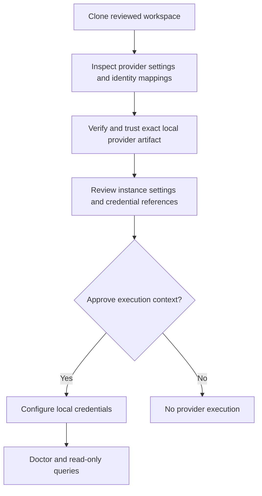

# Team workspaces

Teams share access configuration through Git and keep credentials and execution
approval local. Permesh has no collaboration server and does not synchronize
reports, secrets or trust records.

| Shared and reviewed in Git | Local to each administrator |
| --- | --- |
| Provider instance IDs and nonsecret settings | Installed native packages and binary registrations |
| Credential references | Environment values or native keychain entries |
| Explicit identity aliases and source authority | Canonical-workspace execution approvals |
| Currently supported explicit executable pins | Temporary provider working directories |

Use distinct stable instance IDs for unrelated tenants. Keychain service/account
names bind to instance and credential slot at user level, so reusing an instance
ID in another workspace reuses that local credential entry.

After cloning, inspect configuration and identity mappings before approving
external execution. Install the reviewed provider artifact, establish local
binary trust, then review and approve the instance in the cloned workspace.
Authenticate independently using the configured references. `auth status` checks
local availability; `doctor` performs approved provider health checks. A health
check is not proof of complete discovery visibility.

Approval binds the canonical config path, selected provider configuration,
registration and relevant identity context. A cloned path needs its own approval.
An unrelated provider edit does not revoke another instance's scoped approval;
changed settings, credential references, relevant aliases, authority or binary
do. Older whole-workspace approvals require one explicit reapproval during the
hardening migration. See [the exact scope](adr/0017-provider-scoped-workspace-approval.md).

## Current platform and CI limitations

Workspace schema 1 pins one executable SHA-256 per external instance. Native
artifacts for different OS/CPU targets have different hashes. A single shared
pin therefore does not yet choose each administrator's platform automatically.
Keep target-specific reviewed workspace configurations when needed; do not
silently rewrite shared pins or bypass trust. Target-aware release/lock state is
a tracked P1 design item, not an implemented feature.

CI can supply named `env://` references through its existing secret store. It
must explicitly establish the same registration and workspace approval boundaries.
Do not commit local approval records or tokens to make CI work. Package updates
are explicit and do not adopt new workspace pins automatically.

Queries leave configuration unchanged and keep access graphs in memory. Redirected
JSON can contain sensitive identity and infrastructure metadata; the caller owns
its file permissions, retention and distribution. Permesh does not upload it.
